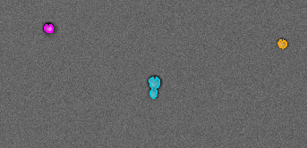
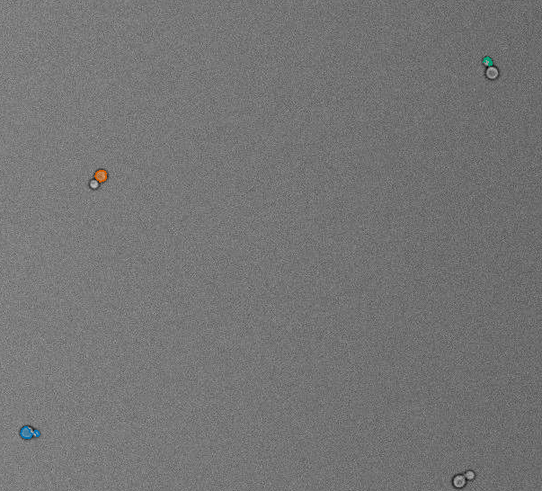
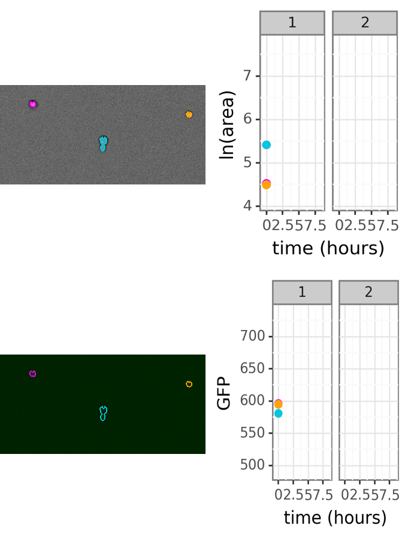
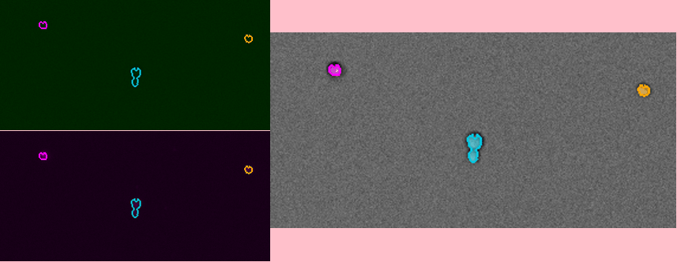

Creating movies of image analysis results
=========================================

One of the most useful ways to determine whether microcolony tracking is working as intended is to look at movies of tracked microcolonies directly. PIE includes a module that allows users to make movies that track growing colonies, fluorescence, and plots measured colony properties over time. Note that movie creation *must* occur after full growth rate analysis has been completed.

Creating default microcolony growth movies
------------------------------------------

The PIE movies module includes a function to automatically create a movie showing colony tracking overlaid on the main imaging channel (brightfield or phase contrast), side-by-side with a plot of each colony's log area over time. These movies will be automatically created for ``extended_display_positions`` when the full growth rate analysis code is run.

The ``make_position_movie`` function takes four inputs:

+ an integer specifying the xy position for which to generate the movie
+ either ``analysis_config_file``, the path to the setup file, or ``analysis_config_obj_df``, a dataframe created by ``PIE.analysis_configuration.process_setup_file``
+ ``colony_subset``, the group of colonies to highlight on the image and growth plot. This argument is optional and defaults to 'growing' if omitted. The options for this argument are:
    + **growing**: label only those colonies that receive a growth rate measurement after filtration
    + **tracked**: label all colonies that were tracked, but not include those that were recognized but then removed because they were e.g. a minor part of a broken-up colony
    + **all**: label all 'colonies' initially detected by PIE
+ ``movie_format``, the file format of the movie to create. This argument is optional and defaults to 'gif' if omitted. The options for this argument are:
    + **jpg** (or **jpeg**): creates a folder with a .jpg format image for each timepoint
    + **tif** (or **tiff**): creates a folder with a .tif format image for each timepoint
    + **gif**: (default) creates gif
    + **h264**: video codec; creates movie with .mov extension. Note that **h264** format requires the h264 encoder, which is automatically installed on some platforms (e.g. MacOSX) but not others.
    + **mjpg** (or **mjpeg**): video codec; creates movie with .mov extension

For example, the code below generates a *.gif*-format movie for any colonies in imaging field 12 of the `growth measurment sample experiment <https://github.com/Siegallab/PIE/blob/master/sample_PIE_setup_files/gr_phase_setup.csv>`_:

.. tabs::

    .. tab:: python

        .. code-block:: python

            import PIE
            PIE.make_position_movie(
                12,
                analysis_config_file=\
                    '/local/path/to/PIE/sample_PIE_setup_files/gr_phase_setup.csv',
                colony_subset='growing',
                movie_format = 'gif'
                )

    .. tab:: command-line

        .. code-block:: bash

            pie make_position_movie 12 /local/path/to/PIE/sample_PIE_setup_files/gr_phase_setup.csv -s growing -m gif

This code should generate the following movie in the **movies** directory in the output folder of the experiment:

.. image:: _static/sample_images/SL_170619_xy12_growing_colonies_movie.gif
  :width: 100%
  :alt: Growing colonies from imaging field 12

In the plot, the solid lines represent the best-fit growth rate estimate, and the length of the dashed lines represent the best-fit lag estimate. Note that while the color identity of each colony is random and will change every time the code is run, assigned colors are consistent between the image panel and the plot panel.

Creating movies with custom microscopy views, plots, and frame arrangements
---------------------------------------------------------------------------

The PIE movie module allows movies to be created from multiple microscopy channels, which may be blended together, and inclusion of plots of any measured colony property. These movie frames can also be combined in an arbitrary way.

With the exception of the default movie described above (`creating default microcolony growth movies`_), any movie in PIE first initializing a 'movie generator', and passing it:

+ the path to the setup file for the experiment based on which you are making your movie
+ a list of cross_phase_colony_tracking_id values from either **colony_properties_combined.csv** or **growth_rates_combined.csv** in your output folder; all the colonies included in a single movie must come from the same imaging position.
+ ``colony_colors`` (optional): a list of colony colors corresponding to each colony, either as color names or hex codes. If colony_colors is not passed, colors used to highlight each colony will be maximally spaced in hue space and assigned to colonies randomly.

For most of the examples below, we will be using data from three colonies of the `two-phase growth rate and fluorescence sample experiment <https://github.com/Siegallab/PIE/blob/master/sample_PIE_setup_files/two_phase_setup.csv>`_: ::

    import PIE
    setup_file=\
        '/local/path/to/PIE/sample_PIE_setup_files/two_phase_setup.csv'
    crossphase_colony_id_list=\
        ['phase_1_xy401_col55','phase_1_xy401_col56','phase_1_xy401_col57']
    color_list=['magenta', 'orange', '#07c5de']
    two_phase_movie_generator=\
        PIE.MovieGenerator(
            crossphase_colony_id_list,
            analysis_config_file = setup_file,
            colony_colors=color_list
            )

Creating cell movies
--------------------

To create a movie showing colony recognition overlaid on brightfield images, we can use the ``make_cell_movie`` method of our movie generator. ``make_cell_movie`` takes the following arguments:

+ an opacity value (between 0 and 1) for the transparency of the shading overlaid on PIE-recognized colonies. If 0, colonies aren't shaded; if 1, shading color is solid.
+ a boundary width for the solid-colored boundaries denoting the edge of detected colonies, in pixels; if 0, no boundaries are shown. Note that pixel values are in terms of the original image size, so if the image is resized during saving, the width of these boundaries may change.
+ ``normalize_intensity``: (optional) whether to readjust image brightness to the range of brightnesses in the image for display; this is especially important for dark images. If set to False, must pass a value to the ``bitdepth`` argument. Default is True.
+ ``expansion_pixels``: (optional) the number of pixels expanding beyond the outermost edge of the detected colonies to include in the image. Default is 10.
+ ``bitdepth``: (optional) the bitdepth of the image (most commonly 16 for original microscopy images, 8 for compressed images such as jpegs). Only needs to be specified if ``normalize_intensity`` is set to False.

We can create a movie using the ``two_phase_movie_generator`` defined above as follows, using all the default settings and specifying just the colony shading opacity (0.5) and the width of the colony recognition bounds (2 pixels): ::

    colony_shading_alpha=0.5
    bound_width=2
    brightfield_movie=\
        two_phase_movie_generator.make_cell_movie(
            colony_shading_alpha,
            bound_width
            )

Saving movies
-------------

We haven't yet saved our movie anywhere. The object we've created, ``brightfield_movie``, can then be saved to a movie or used as a component of a larger movie. To save ``brightfield_movie`` directly, we can use the ``save_movie`` function. We need to pass the following to this function:

+ The movie object being written
+ ``movie_output_path``: the directory in which to save the movie file(s).
+ ``movie_name``: the movie filename (don't include the extenstion, as this will be appended automatically)
+ ``movie_format``: the output format of the movie. Can be 'jpg' (or 'jpeg'), 'tif' ('tiff'), 'gif', 'h264', or 'mjpg' ('mjpeg'). movie_format can be a string or a list of strings (for multiple output formats from the same movie.)
+ ``movie_width``: (optional) the width of the movie, in pixels.
+ ``movie_height``: (optional) the height of the movie, in pixels.
   If no width and/or height is passed, the respective dimension of the movie will be the dimension of the region of interest (ROI) of the microscopy images, which is the area in which the colonies of interest are located, expanded by ``expansion_pixels``. Note that regardless of movie_width and movie_height, the aspect ratio of the ROI will be preserved, with extra space in the frame filled in with a solid color.
+ ``blank_color``: (optional) the color of any empty parts of movie frames (e.g. if the aspect ratio of the full movie doesn't match the aspect ratio of the microscopy ROI). Default is 'white'.
+ ``duration``: (optional) the duration in milliseconds of each frame in 'gif', 'h264', or 'mjpeg' format movies. Default is 1000.
+ ``loop``: (optional) for 'gif' format movies, the number of loops the gif should repeat. None is no repetition, 0 is repetition forever. Default is 0.
+ ``jpeg_quality``: (optional) for 'jpg' format 'movies', the jpg quality of the individual movie frames, from 1 to 100. Default is 95.

For *gif* and *h264*/*mjpg* formats, movies will be saved in ``movie_output_path/movie_name.gif`` or ``movie_output_path/movie_name.mp4``, respectively. For tif/jpeg outputs, individual images will be saved inside ``movie_output_path/movie_name/``, with consecutively numbered filenames. Note that *h264* format requires the h264 encoder, which is automatically installed on some platforms (e.g. MacOSX) but not others.

We can use the following code to save ``brightfield_movie`` created above in a directory called ``sample_movies`` in the PIE folder: ::

    PIE.save_movie(
        brightfield_movie,
        '/local/path/to/PIE/sample_movies',
        'brightfield_movie_sample',
        'gif'
        )

Creating and blending fluorescence movies
-----------------------------------------

The two-phase sample experiment collected data in two fluorescence channels: one imaging GFP, and one that imaged red MitoTracker dye. Creating movies in fluorescent channels is similar to creating main imaging channel movies but colonies are not shaded, as this would obscure fluorescence (so there is no argument for colony shading opacity); there are also two additional arguments:

+ ``fluor_channel``: the name of the fluorescence channel to display (as listed under 'fluor_channel_names' in the setup file)
+ ``fluor_color``: (optional) the color in which the maximum-intensity pixels will be displayed for the main channel and the postphase channel; all other pixels will be displayed in a gradient from black to that color. Default is 'white'.

We can again use the ``two_phase_movie_generator`` created above to create movies of MitoTracker and GFP fluorescence, in magenta and green, respectively, by setting ``fluor_color``; we will also avoid within-image intensity normalization and instead passing the bitdepth of these images (in this case, 11): ::

    bound_width=2
    im_bitdepth=11
    gfp_movie=\
        two_phase_movie_generator.make_fluor_movie(
            'GFP',
            bound_width,
            fluor_color='green',
            normalize_intensity=False,
            bitdepth=im_bitdepth
            )
    mt_movie=\
        two_phase_movie_generator.make_fluor_movie(
            'MitoTracker',
            bound_width,
            fluor_color='magenta',
            normalize_intensity=False,
            bitdepth=im_bitdepth
            )

We can now either save these movies individually, or blend them into a single image, using the ``merge_movie_channels`` function. This function takes microscopy movie objects (such as those created by ``make_fluor_movie`` or ``make_cell_movie``) of the same size and merges the colors at each timepoint, with an optional argument, ``intens_mult_list``, which takes a list of multipliers for the intensities (brightnesses) for each movie to be merged; if the argument is omitted, the movies are merged with unmodified intensity.

Here, we will merge ``gfp_movie`` and ``mt_movie``, but increase the brightness of gfp_movie, since the signal level is low; we will then save this movie as `saving movies`_. ::

    merged_fluor_movie=\
        PIE.merge_movie_channels(
            gfp_movie,
            mt_movie,
            intens_mult_list=[2.5,1]
            )
    PIE.save_movie(
        merged_fluor_movie,
        '/local/path/to/PIE/sample_movies',
        'merged_fluor_movie_sample',
        'gif'
        )

Creating post-phase fluorescence movies
---------------------------------------

For experiments that have a post-phase fluorescence stage (e.g. `this sample experiment <https://github.com/Siegallab/PIE/blob/master/sample_PIE_setup_files/gr_with_postfluor_setup.csv>`_), the ``make_fluor_movie`` method above does not work, since fluorescence is collected at a separate timepoint after the imaging phase is complete, and ``make_cell_movie`` would not show the post-phase fluorescence image. For these experiments, we can create a movie that shows brightfield/phase contrast images for a phase followed by the post-phase fluorescence image using ``make_postfluor_movie``. This takes an opacity value for shading colonies during the main experimental phase (e.g. brightfield) images, and the rest of the arguments are as for ``make_fluor_movie``.

Here, we can make a post-fluorescence movie based on the `post-phase fluorescent experiment <https://github.com/Siegallab/PIE/blob/master/sample_PIE_setup_files/gr_with_postfluor_setup.csv>`_ ::

    import PIE
    setup_file=\
        '/local/path/to/PIE/sample_PIE_setup_files/gr_with_postfluor_setup.csv'
    crossphase_colony_id_list=\
        ['phase_1_xy735_col10','phase_1_xy735_col7','phase_1_xy735_col4']
    color_list=['#0072B2','#D55E00','#009E73']
    postphase_fluor_movie_generator=\
        PIE.MovieGenerator(
            crossphase_colony_id_list,
            analysis_config_file=setup_file,
            colony_colors=color_list
            )
    colony_shading_alpha=0.5
    bound_width=2
    postfluor_movie=\
        postphase_fluor_movie_generator.make_postfluor_movie(
            colony_shading_alpha,
            'GFP',
            bound_width,
            fluor_color='green',
            normalize_intensity=True
            )
    PIE.save_movie(
          postfluor_movie,
          '/local/path/to/PIE/sample_movies',
          'postphase_fluor_movie',
          'gif')

Note that the colony outlines shown on the fluorescence image correspond to the outlines of the colonies at the timepoint when the fluorescence data is collected, which are determined based on the ``fluor_channel_timepoints`` parameter in the configuration file.

Creating plots
--------------

In addition to microscopy movies, we can also create animated plots of any colony property recorded in *colony_properties_combined.csv*, as well as 'growth rate' plots, which plot change in log area over time with lines representing growth rate and lag (as in  `creating default microcolony growth movies`_.)

We can use the ``two_phase_movie_generator`` from above to make a plot of mean per-pixel colony GFP levels over time using ``make_property_plot_movie``, to which we can pass:

+ the name of the colony property to plot (must match a column name in *colony_properties_combined.csv*)
+ ``facet_override``: (optional) by default, plots are split into facets for every experimental phase when timepoints in phases are not continuously numbered; to override this behavior, set ``facet_override`` to True.
+ ``y_label_override``: (optional) a string to change the label on the plot y axis; default is the name of the property to plot ::

    gfp_plot_movie=\
        two_phase_movie_generator.make_property_plot_movie(
            'col_mean_ppix_flprop_GFP',
            y_label_override='GFP'
            )

To plot growth rate (as in `creating default microcolony growth movies`_), we can use a special method, ``make_growth_plot_movie``; this takes three optional arguments:

+ ``facet_override``: see above
+ ``add_growth_line``: include line representing the best estimate for growth rate over the timepoints used in the calculation. Default is True.
+ ``add_lag_line``: include dotted line representing best estimate for lag time. Default is True. ::

    growth_plot_movie=\
        two_phase_movie_generator.make_growth_plot_movie()

The plot movies can be saved as described in `saving movies`_, with the exception that ``movie_height`` and ``movie_width`` *must* be passed to the ``save_movie`` argument when the movie consists only of plots.

Combining movie panels
----------------------

Movies with multiple panels can also be created in PIE; the interface for this is a function called ``make_movie_grid``, which is inspired by the ``plot_grid`` function from the `cowplot package in R <https://wilkelab.org/cowplot/articles/plot_grid.html>`_, and has a subset of ``plotgrid``'s functionality and interface.

At its simplest, ``make_movie_grid`` can create a combined movie from multiple movie objects (or other movie grids); here, we will arrange the brightfield movie and the growth rate plot in one row, and the gfp fluorescence and gfp plot in the row below: ::

    simple_grid=PIE.make_movie_grid(
        brightfield_movie,
        growth_plot_movie,
        gfp_movie,
        gfp_plot_movie,
        nrow=2
        )
    PIE.save_movie(
        simple_grid,
        '/local/path/to/PIE/sample_movies',
        'simple_grid_movie',
        'gif',
        movie_height=900
        )

(Note that we passed a 'movie_height' parameter here to prevent the plots from being vertically squished here)

We can use additional options in ``make_movie_grid``, as well as combinations of movie grids, to make more complex plots. For example, we can make a movie where the left column is our two fluorescent movies, and our right column is just the brightfield movie. We can also set relative widths of the columns via the *rel_widths* argument (or their relative heights using *rel_heights*); here, we will make the brightfield movie panel 1.5 times as wide as the fluorescent movie panel. ::

    fluor_grid=PIE.make_movie_grid(
        gfp_movie,
        mt_movie,
        ncol = 1
        )
    complex_grid=PIE.make_movie_grid(
        fluor_grid,
        brightfield_movie,
        ncol = 2,
        rel_widths = [1,1.5]
        )

This time, when saving the movie, we can pass a ``blank_color`` argument to set the color of the background not filled by movie frames: ::

    PIE.save_movie(
        complex_grid,
        '/local/path/to/PIE/sample_movies',
        'complex_grid_movie',
        'gif',
        blank_color='pink'
        )

Notice that because the aspect ratio of microcopy movies remains constant when images are rescaled, there is now blank space in the frame on the right; it is filled with pink, as specified in ``blank_color``.
