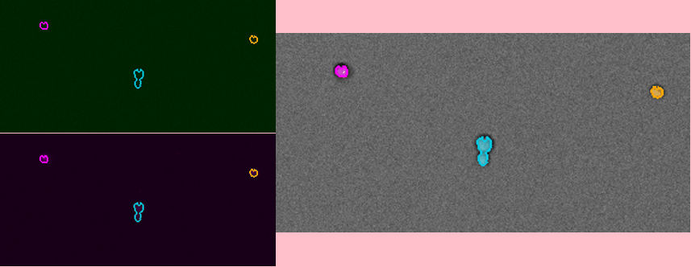

# PIE Readme

Processing Images Easily (PIE) automatically tracks growing microcolonies in low-resolution brightfield and phase-contrast microscopy images. The program works for recognizing microcolonies in a wide range of microbes, and allows automated measurement of growth rate, lag times, and (if applicable) fluorescence across time for microcolonies founded by single cells. PIE recognizes colony outlines very robustly and accurately across a wide range of image brightnesses and focal depths, and allows simultaneous measurements of growth properties and fluorescence intensities with very high throughput (in our lab, ~100,000 colonies per experiment), including in complex, multiphase experiments.

## Table of Contents

- [System requirements](#system-requirements)
- [Installing PIE](#installing-pie)
- [Running PIE](#running-pie)
  * [Running PIE single-image analysis](#running-pie-single-image-analysis)
  * [Running PIE multi-image experiments](#running-pie-multi-image-experiments)
    + [Setting up multi-image experiments](#setting-up-multi-image-experiments)
      - [General setup](#general-setup)
      - [Phases](#phases)
      - [Setup file Examples](#setup-file-examples)
    + [Running the experiment](#running-the-experiment)
    + [Running PIE with batch submission](#running-pie-with-batch-submission)
      - [Analyzing individual imaged xy positions](#analyzing-individual-imaged-xy-positions)
      - [Combining position-wise data and calculating growth rates](#combining-position-wise-data-and-calculating-growth-rates)
  * [Analysis Outputs](#analysis-outputs)
- [Analysis details](#analysis-details)
- [Creating movies of image analysis results](#creating-movies-of-image-analysis-results)
  * [Creating default microcolony growth movies](#creating-default-microcolony-growth-movies)
  * [Creating movies with custom microscopy views, plots, and frame arrangements](#creating-movies-with-custom-microscopy-views--plots--and-frame-arrangements)
    + [Creating cell movies](#creating-cell-movies)
    + [Saving movies](#saving-movies)
    + [Creating and blending fluorescence movies](#creating-and-blending-fluorescence-movies)
    + [Creating post-phase fluorescence movies](#creating-post-phase-fluorescence-movies)
    + [Creating plots](#creating-plots)
    + [Combining movie panels](#combining-movie-panels)

<small><i><a href='http://ecotrust-canada.github.io/markdown-toc/'>Table of contents generated with markdown-toc</a></i></small>

---

## System requirements

PIE runs in python, and is compatible with Python 3.6 or higher.

The full list of required python packages is listed in the [requirements.txt](requirements.txt) file; these will be automatically installed using the code [below](#installing-pie).

## Installing PIE

To install PIE, you will first need to 'clone' (download) the repository. This can be done in one of two ways:

 * Press the green **'Code'** button at the top of this website, select 'Download ZIP', and save the file to a directory on your computer. You will then need to unzip the file (usually by double-clicking it), which will create a directory called *'PIE'* containing all the code.

OR

 * Enter terminal (on a Mac/Linux)/CommandPrompt (on Windows, if you have *git* installed), enter the directory into which you'd like to download the *'PIE'* directory, and type
 ```
 git clone https://github.com/Siegallab/PIE.git
 ```

After cloning the repository, PIE can easily be installed using [pip](https://pip.pypa.io/en/stable/):
```
cd PIE/
pip install -e .
```

## Running PIE

### Running PIE single-image analysis

To analyze a single image using PIE, you can use the `analyze_single_image` function, which takes an image filename (and some analysis parameters) as inputs:

 ```python
 import PIE
 colony_mask, colony_property_df=\
     PIE.analyze_single_image(input_im_path, output_path, image_type,
         hole_fill_area, cleanup, max_proportion_exposed_edge,
         save_extra_info)
 ```
 This function runs PIE, creates output folders within `output_path`, and writes files containing the binary colony mask as an 8-bit tif file (**colony_masks** folder), a jpeg of the original image (**jpegGRimages** folder), and a csv file containing the properties (e.g. area) of all the colonies in the image (**single_image_colony_centers** folder). If save_extra_info is *True*, then additional files are saved in the following folders:

 * **boundary_ims**: a jpeg of the original image, overlaid with the contours of the colony mask

 * **threshold_plots**: plots demonstrating the detection of the threshold based on the log histogram of a background-corrected image

 * **colony_center_overlays**: a jpeg of the original image, overlaid with the contours of the colony mask and a transparent mask of the cell centers detected after thresholding

 The inputs into this functions are as follows:

 * `input_im_path`: the path to the image to be analyzed

 * `output_path`: the directory in which image analysis folders should be created

 * `image_type`: The type of micrscopy used to generate images; *'brightfield'* or *'phasecontrast'*

 * `hole_fill_area`: the area (in pixels) of the largest size hole to fill in colony masks after image analysis. For low-res yeast imaging, we recommend setting this value to numpy.inf (i.e. all the holes in the colonies get filled) *0-numpy.inf*

 * `cleanup`: whether or not to perform 'cleanup' of spurious pieces of background attached to colonies; *True* or *False*. (we recommend trying PIE both with and without cleanup on a set of sample images; you can see the Li, Plavskin *et al.* paper for details)

 * `max_proportion_exposed_edge`: maximum proportion (0-1) of the perimeter of a PIE-detected gradient object ('PIE piece') that may be non-adjacent to another PIE piece to avoid being removed during 'cleanup' steps; *0-1*, only used if `cleanup` is *True*. 0.75 works well for 10x yeast images

 * `save_extra_info`: whether to write additional files described above; *True* or *False*

 The function returns:

 * `colony_mask`: a numpy boolean matrix with True at positions corresponding to pixels in the original image where a colony was detected

 * `colony_property_df`: a pandas dataframe containing the properties of every colony in the image (same as the ones saved to **single_image_colony_centers**, but also containing a list of all the pixels in which each colony was detected).

### Running PIE multi-image experiments

#### Setting up multi-image experiments

Complete PIE experiments require a single *csv*-format setup file to set up. Some templates for experiment types commonly run in the Siegal lab can be found in [sample_PIE_setup_files](sample_PIE_setup_files).

##### General setup

To set up a file for an experiment, modify an existing setup file (or make your own from scratch, although this is not recommended!) More detailed explanations of all the parameters will be added later, but for now, you can just read the *Explanation* column for each parameter in the setup files provided.

##### Phases

Each experiment may consist of one or more phases; the list of phases in the experiment must be provided in the experimental setup file. A single phase consists of a single, continuously labeled bout of imaging. Colony outlines are always calculated based on a "main channel", which should consist of either brightfield or phase contrast images; the colonies identified in the main channel will then be overlaid on any fluorescent images in the phase to calculate fluorescence levels.

A phase can also be run that takes only fluorescent images for a single timepoint, in which case `parent_phase` should be set to the phase number of the phase containing the brightfield/phase contrast data corresponding to the fluorescent images (see [setup file examples](#setup-file-examples) below).

During growth rate analysis, growth rates will be calculated independently for any phase that contains multiple timepoints, but colony identities will be linked across phases.

##### Setup file Examples

Here are some examples of setup files for experiments commonly done in the Siegal Lab; each corresponds to a single test data folder located in [PIE_test_data/IN/](PIE_test_data/IN):
 * [setup file](sample_PIE_setup_files/gr_phase_setup.csv) for an experiment consisting of only growth rate measurements
 * [setup file](sample_PIE_setup_files/gr_with_postfluor_setup.csv) for an experiment consisting of growth rate measurements, followed by by a single timepoint of post-phase fluorescent imaging
 * [setup file](sample_PIE_setup_files/two_phase_setup.csv) for an experiment consisting of two phases of growth rate measurements, the first with two fluorescent channels, the second with a single fluorescent channel

#### Running the experiment

To run a full image analysis experiment using PIE, you can use the `run_growth_rate_analysis` function, which takes a setup file path as input:

```python
import PIE
PIE.run_growth_rate_analysis(analysis_config_file =
    '/local/path/to/PIE/sample_PIE_setup_files/gr_phase_setup.csv')
```
You can also use the `pie` command-line interface:

```console
pie run /local/path/to/PIE/sample_PIE_setup_files/gr_phase_setup.csv
```

Finally, running a single-phase, brightfield-only analysis with all-default inputs, or modifying just a couple of options at a time, can be achieved without a setup file:

```python
import PIE
PIE.run_default_growth_rate_analysis(
    input_path,
    output_path,
    total_timepoint_num)
```

To achieve the same results as using the [provided single-phase, brightfield-only experimental setup file](sample_PIE_setup_files/gr_phase_setup.csv), some options need to be changed when using the default analysis; for example, the sample data can be analyzed as follows:

```python
import PIE
import numpy as np
PIE.run_default_growth_rate_analysis(
    input_path='/local/path/to/PIE/PIE_test_data/IN/SL_170619_2_GR_small',
    output_path='/local/path/to/PIE/PIE_test_data/out/SL_170619_2_GR_small',
    total_timepoint_num=10, total_xy_position_num=1000,
    timepoint_spacing=3600, extended_display_positions=[4, 11],
    growth_window_timepoints=7,
    max_area_pixel_decrease=500, min_colony_area=30,
    max_colony_area=np.inf, min_correlation=0.9, min_neighbor_dist=100,
    repeat_image_analysis_and_tracking=False)
```

#### Running PIE with batch submission

PIE is set up to easily be run via batch submission. To do this, the colony tracking step for each individual xy position is separated from the steps that compile the data across positions and calculate growth rates.

##### Analyzing individual imaged xy positions

To analyze each imaged position individually (e.g. via batch jobs), you need to pass the integer corresponding to the xy position being analyzed and the path to the setup file. This can be done e.g. for position 11 of the `SL_170619_2_GR_small` sample data either in python:

```python
import PIE
PIE.track_colonies_single_pos(
    11,
    analysis_config_file=
        '/local/path/to/PIE/sample_PIE_setup_files/gr_phase_setup.csv'
    )
```

or using the command-line interface

```console
pie track_single_position 11 /local/path/to/PIE/sample_PIE_setup_files/gr_phase_setup.csv
```

In addition, the dataframe returned by `PIE.process_setup_file` can be directly passed to `PIE.track_colonies_single_pos` instead of the setup filepath itself, which may be useful when automating image analysis pipelines:

```python
import PIE
config_df=PIE.process_setup_file('/local/path/to/PIE/sample_PIE_setup_files/gr_phase_setup.csv')
PIE.track_colonies_single_pos(
    xy_pos_idx,
    analysis_config_obj_df=config_df
    )
```

##### Combining position-wise data and calculating growth rates

After every imaged xy position has been analyzed, the data can be combined and growth rates can be calculated by simply running `PIE.run_growth_rate_analysis(...)` (or `pie run ...`), as in [*Running the experiment*](#running-the-experiment), with the default `repeat_image_analysis_and_tracking=False` option.

### Analysis Outputs

Outputs of the PIE experiment can be found in the directory provided by the `output_folder` path in the setup file. Each output folder includes one or multiple folders corresponding to phases of the experiment, named **phase_[*phase_name*]**, with all phase-specific data contained within.

Phase-specific output folders contain:

 * **growth_rates.csv** for each phase of the experiment; created only after running `PIE.run_growth_rate_analysis(...)` or `pie run ...`. For all colonies that pass the filtration steps, this file contains:
   + colony growth rates
   + colony lag times
   + if applicable, a cross-section/summary of colony fluorescent data
 * a folder called **positionwise_colony_property_matrices** containing *csv* files for each quantified colony property, tracked across time, for each colony; created only after running `PIE.run_growth_rate_analysis(...)` or `pie run ...`. This is phase-specific data from each column of **colony_properties_combined.csv** (see below) in matrix form, and can be useful for performing custom analyses after running PIE
 * phase-specific image analysis outputs (see [*Running PIE single-image analysis*](#running-PIE-single-image-analysis), although without a **single_image_colony_centers** folder, as this data is saved in the colony properties file); these are created during the analysis of every individual imaging position
 * **filtered_colonies.csv**, containing a list of colony IDs for colonies that were filtered out at one or more timepoints over the course of the analysis, with the first timepoint a colony is removed due to a particular filter listed in that filter's column. This data can be helpful for advanced users exploring the effects of tuning filtration options in the experimental setup file.

In addition to the phase-specific folders, the output folder contains:
 * **colony_properties_combined.csv**: containing the (unfiltered) properties of every colony identified in every timepoint during analysis, and the colony tracking data, in *csv* format; created only after running `PIE.run_growth_rate_analysis(...)` or `pie run ...`
 * **growth_rates_combined.csv**: containing the data from the phase-specific growth rate files but tracked across all phases of the experiment; created only after running `PIE.run_growth_rate_analysis(...)` or `pie run ...`
 * **setup_file.csv**: a copy of the setup configuration file used for running the experiment

## Analysis details

see the [PIE preprint](https://www.biorxiv.org/content/10.1101/253724v2) for details on how growth rates and lags are calculated.

## Creating movies of image analysis results

One of the most useful ways to determine whether microcolony tracking is working as intended is to look at movies of tracked microcolonies directly. PIE includes a module that allows users to make movies that track growing colonies, fluorescence, and plots measured colony properties over time. Note that movie creation *must* occur after full growth rate analysis has been completed.

### Creating default microcolony growth movies

The PIE movies module includes a function to automatically create a movie showing colony tracking overlaid on the main imaging channel (brightfield or phase contrast), side-by-side with a plot of each colony's log area over time. These movies will be automatically created for `extended_display_positions` when the full growth rate analysis code is run.

The `make_position_movie` function takes three inputs:

* an integer specifying the xy position for which to generate the movie
* either `analysis_config_file`, the path to the setup file, or `analysis_config_obj_df`, a dataframe created by `PIE.analysis_configuration.process_setup_file`
* `colony_subset`, the group of colonies to highlight on the image and growth plot. This argument is optional and defaults to 'growing' if omitted. The options for this argument are:
   + **growing**: label only those colonies that receive a growth rate measurement after filtration
   + **tracked**: label all colonies that were tracked, but not include those that were recognized but then removed because they were e.g. a minor part of a broken-up colony
   + **all**: label all 'colonies' initially detected by PIE

For example, the code below generates a *.gif*-format movie for any colonies in imaging field 12 of the [growth measurment sample experiment](sample_PIE_setup_files/gr_phase_setup.csv):

```python
import PIE
PIE.make_position_movie(
  12,
  analysis_config_file=\
    '/local/path/to/PIE/sample_PIE_setup_files/gr_phase_setup.csv',
  colony_subset='growing'
  )
```

This code should generate the following movie in the **movies** directory in the output folder of the experiment:


In the plot, the solid lines represent the best-fit growth rate estimate, and the length of the dashed lines represent the best-fit lag estimate. Note that while the color identity of each colony is random and will change every time the code is run, assigned colors are consistent between the image panel and the plot panel.

You can also use the `pie` command-line interface to create these movies:

```console
pie make_position_movie 12 /local/path/to/PIE/sample_PIE_setup_files/gr_phase_setup.csv growing
```

### Creating movies with custom microscopy views, plots, and frame arrangements

The PIE movie module allows movies to be created from multiple microscopy channels, which may be blended together, and inclusion of plots of any measured colony property. These movie frames can also be combined in an arbitrary way.

With the exception of the default movie [described above](#creating-default-microcolony-growth-movies), any movie in PIE first initializing a 'movie generator', and passing it:

* the path to the setup file for the experiment based on which you are making your movie
* a list of cross_phase_colony_tracking_id values from either **colony_properties_combined.csv** or **growth_rates_combined.csv** in your output folder; all the colonies included in a single movie must come from the same imaging position.
* `colony_colors` (optional): a list of colony colors corresponding to each colony, either as color names or hex codes. If colony_colors is not passed, colors used to highlight each colony will be maximally spaced in hue space and assigned to colonies randomly.

For most of the examples below, we will be using data from three colonies of the [two-phase growth rate and fluorescence sample experiment](sample_PIE_setup_files/two_phase_setup.csv):

```python
import PIE
setup_file=\
  '/local/path/to/PIE/sample_PIE_setup_files/two_phase_setup.csv'
crossphase_colony_id_list=\
  ['phase_1_xy401_col55','phase_1_xy401_col56','phase_1_xy401_col57']
color_list=['magenta', 'orange', '#07c5de']
two_phase_movie_generator=\
  PIE.MovieGenerator(
    crossphase_colony_id_list,
    analysis_config_file = setup_file,
    colony_colors=color_list
    )
```

#### Creating cell movies

To create a movie showing colony recognition overlaid on brightfield images, we can use the `make_cell_movie` method of our movie generator. `make_cell_movie` takes the following arguments:

* an opacity value (between 0 and 1) for the transparency of the shading overlaid on PIE-recognized colonies. If 0, colonies aren't shaded; if 1, shading color is solid.
* a boundary width for the solid-colored boundaries denoting the edge of detected colonies, in pixels; if 0, no boundaries are shown. Note that pixel values are in terms of the original image size, so if the image is resized during saving, the width of these boundaries may change.
* `normalize_intensity`: (optional) whether to readjust image brightness to the range of brightnesses in the image for display; this is especially important for dark images. If set to False, must pass a value to the `bitdepth` argument. Default is True.
* `expansion_pixels`: (optional) the number of pixels expanding beyond the outermost edge of the detected colonies to include in the image. Default is 10.
* `bitdepth`: (optional) the bitdepth of the image (most commonly 16 for original microscopy images, 8 for compressed images such as jpegs). Only needs to be specified if `normalize_intensity` is set to False.

We can create a movie using the `two_phase_movie_generator` defined above as follows, using all the default settings and specifying just the colony shading opacity (0.5) and the width of the colony recognition bounds (2 pixels):

```python
colony_shading_alpha=0.5
bound_width=2
brightfield_movie=\
  two_phase_movie_generator.make_cell_movie(
    colony_shading_alpha,
    bound_width
    )
```

#### Saving movies

We haven't yet saved our movie anywhere. The object we've created, `brightfield_movie`, can then be saved to a movie or used as a component of a larger movie. To save `brightfield_movie` directly, we can use the `save_movie` function. We need to pass the following to this function:
* The movie object being written
* `movie_output_path`: the directory in which to save the movie file(s).
* `movie_name`: the movie filename (don't include the extenstion, as this will be appended automatically)
* `movie_format`: the output format of the movie. Can be 'jpg' (or 'jpeg'), 'tif' ('tiff'), 'gif', 'h264', or 'mjpg' ('mjpeg'). movie_format can be a string or a list of strings (for multiple output formats from the same movie.)
* `movie_width`: (optional) the width of the movie, in pixels.
* `movie_height`: (optional) the height of the movie, in pixels.
   If no width and/or height is passed, the respective dimension of the movie will be the dimension of the region of interest (ROI) of the microscopy images, which is the area in which the colonies of interest are located, expanded by `expansion_pixels`. Note that regardless of movie_width and movie_height, the aspect ratio of the ROI will be preserved, with extra space in the frame filled in with a solid color.
* `blank_color`: (optional) the color of any empty parts of movie frames (e.g. if the aspect ratio of the full movie doesn't match the aspect ratio of the microscopy ROI). Default is 'white'.
* `duration`: (optional) the duration in milliseconds of each frame in 'gif', 'h264', or 'mjpeg' format movies. Default is 1000.
* `loop`: (optional) for 'gif' format movies, the number of loops the gif should repeat. None is no repetition, 0 is repetition forever. Default is 0.
* `jpeg_quality`: (optional) for 'jpg' format 'movies', the jpg quality of the individual movie frames, from 1 to 100. Default is 95.

For *gif* and *h264*/*mjpg* formats, movies will be saved in `movie_output_path/movie_name.gif` or `movie_output_path/movie_name.mp4`, respectively. For tif/jpeg outputs, individual images will be saved inside `movie_output_path/movie_name/`, with consecutively numbered filenames. Please note that *h264* format requires the h264 encoder, which is automatically installed on some platforms (e.g. MacOSX) but not others.

We can use the following code to save `brightfield_movie` in the `sample_images` directory in the PIE folder:

```python
PIE.save_movie(
  brightfield_movie,
  '/local/path/to/PIE/sample_images/movies',
  'brightfield_movie_sample',
  'gif')
```


#### Creating and blending fluorescence movies

The two-phase sample experiment collected data in two fluorescence channels: one imaging GFP, and one that imaged red MitoTracker dye. Creating movies in fluorescent channels is similar to creating main imaging channel movies but colonies are not shaded, as this would obscure fluorescence (so there is no argument for colony shading opacity); there are also two additional arguments:
* `fluor_channel`: the name of the fluorescence channel to display (as listed under 'fluor_channel_names' in the setup file)
* `fluor_color`: (optional) the color in which the maximum-intensity pixels will be displayed for the main channel and the postphase channel; all other pixels will be displayed in a gradient from black to that color. Default is 'white'.

We can again use the `two_phase_movie_generator` created above to create movies of MitoTracker and GFP fluorescence, in magenta and green, respectively, by setting `fluor_color`; we will also avoid within-image intensity normalization and instead passing the bitdepth of these images (in this case, 11):

```python
bound_width=2
im_bitdepth=11
gfp_movie=\
  two_phase_movie_generator.make_fluor_movie(
    'GFP',
    bound_width,
    fluor_color='green',
    normalize_intensity=False,
    bitdepth=im_bitdepth
    )
mt_movie=\
  two_phase_movie_generator.make_fluor_movie(
    'MitoTracker',
    bound_width,
    fluor_color='magenta',
    normalize_intensity=False,
    bitdepth=im_bitdepth
    )
```

We can now either save these movies individually, or blend them into a single image, using the `merge_movie_channels` function. This function takes microscopy movie objects (such as those created by `make_fluor_movie` or `make_cell_movie`) of the same size and merges the colors at each timepoint, with an optional argument, `intens_mult_list`, which takes a list of multipliers for the intensities (brightnesses) for each movie to be merged; if the argument is omitted, the movies are merged with unmodified intensity.

Here, we will merge `gfp_movie` and `mt_movie`, but increase the brightness of gfp_movie, since the signal level is low; we will then save this movie as [above](#saving-movies).

```python
merged_fluor_movie=\
  PIE.merge_movie_channels(
    gfp_movie,
    mt_movie,
    intens_mult_list=[2.5,1]
    )
PIE.save_movie(
  merged_fluor_movie,
  '/local/path/to/PIE/sample_images/movies',
  'merged_fluor_movie_sample',
  'gif')
```


#### Creating post-phase fluorescence movies

For experiments that have a post-phase fluorescence stage (e.g. [this sample experiment](sample_PIE_setup_files/gr_with_postfluor_setup.csv)), the `make_fluor_movie` method above does not work, since fluorescence is collected at a separate timepoint after the imaging phase is complete, and `make_cell_movie` would not show the post-phase fluorescence image. For these experiments, we can create a movie that shows brightfield/phase contrast images for a phase followed by the post-phase fluorescence image using `make_postfluor_movie`. This takes an opacity value for shading colonies during the main experimental phase (e.g. brightfield) images, and the rest of the arguments are as for `make_fluor_movie`.

Here, we can make a post-fluorescence movie based on the [post-phase fluorescence experiment](sample_PIE_setup_files/gr_with_postfluor_setup.csv)

```python
import PIE
setup_file=\
  '/local/path/to/PIE/sample_PIE_setup_files/gr_with_postfluor_setup.csv'
crossphase_colony_id_list=\
  ['phase_1_xy735_col10','phase_1_xy735_col7','phase_1_xy735_col4']
color_list=['#0072B2','#D55E00','#009E73']
postphase_fluor_movie_generator=\
  PIE.MovieGenerator(
    crossphase_colony_id_list,
    analysis_config_file=setup_file,
    colony_colors=color_list
    )
colony_shading_alpha=0.5
bound_width=2
postfluor_movie=\
  postphase_fluor_movie_generator.make_postfluor_movie(
    colony_shading_alpha,
    'GFP',
    bound_width,
    fluor_color='green',
    normalize_intensity=True
    )
PIE.save_movie(
  postfluor_movie,
  '/local/path/to/PIE/sample_images/movies',
  'postphase_fluor_movie',
  'gif')
```


Note that the colony outlines shown on the fluorescence image correspond to the outlines of the colonies at the timepoint when the fluorescence data is collected, which are determined based on the `fluor_channel_timepoints` parameter in the configuration file.

#### Creating plots

In addition to microscopy movies, we can also create animated plots of any colony property recorded in *colony_properties_combined.csv*, as well as 'growth rate' plots, which plot change in log area over time with lines representing growth rate and lag (as in the [default movies](#creating-default-microcolony-growth-movies).)

We can use the `two_phase_movie_generator` to make a plot of mean per-pixel colony GFP levels over time using `make_property_plot_movie`, to which we can pass:

* the name of the colony property to plot (must match a column name in *colony_properties_combined.csv*)
* `facet_override`: (optional) by default, plots are split into facets for every experimental phase when timepoints in phases are not continuously numbered; to override this behavior, set `facet_override` to True.
* `y_label_override`: (optional) a string to change the label on the plot y axis; default is the name of the property to plot

```python
gfp_plot_movie=\
  two_phase_movie_generator.make_property_plot_movie(
    'col_mean_ppix_flprop_GFP',
    y_label_override='GFP'
    )
```

To plot growth rate (as in the [default movie](#creating-default-microcolony-growth-movies)), we can use a special method, `make_growth_plot_movie`; this takes three optional arguments:

* `facet_override`: see above
* `add_growth_line`: include line representing the best estimate for growth rate over the timepoints used in the calculation. Default is True.
* `add_lag_line`: include dotted line representing best estimate for lag time. Default is True.

```python
growth_plot_movie=\
  two_phase_movie_generator.make_growth_plot_movie()
```

The plot movies can be saved as [above](#saving-movies), with the exception that `movie_height` and `movie_width` *must* be passed to the `save_movie` argument when the movie consists only of plots.

#### Combining movie panels

Movies with multiple panels can also be created in PIE; the interface for this is a function called `make_movie_grid`, which is inspired by the [`plot_grid` function from the `cowplot` package in R](https://wilkelab.org/cowplot/articles/plot_grid.html), and has a subset of `plotgrid`'s functionality and interface.

At its simplest, `make_movie_grid` can create a combined movie from multiple movie objects (or other movie grids); here, we will arrange the brightfield movie and the growth rate plot in one row, and the gfp fluorescence and gfp plot in the row below:

```python
simple_grid=PIE.make_movie_grid(
  brightfield_movie,
  growth_plot_movie,
  gfp_movie,
  gfp_plot_movie,
  nrow=2
  )
PIE.save_movie(
  simple_grid,
  '/local/path/to/PIE/sample_images/movies',
  'simple_grid_movie',
  'gif',
  movie_height=900)
```


(Note that we passed a 'movie_height' parameter here to prevent the plots from being vertically squished here)

We can use additional options in `make_movie_grid`, as well as combinations of movie grids, to make more complex plots. For example, we can make a movie where the left column is our two fluorescent movies, and our right column is just the brightfield movie. We can also set relative widths of the columns via the *rel_widths* argument (or their relative heights using *rel_heights*); here, we will make the brightfield movie panel 1.5 times as wide as the fluorescent movie panel.

```python
fluor_grid=PIE.make_movie_grid(
  gfp_movie,
  mt_movie,
  ncol = 1
  )
complex_grid=PIE.make_movie_grid(
  fluor_grid,
  brightfield_movie,
  ncol = 2,
  rel_widths = [1,1.5]
  )
```

This time, when saving the movie, we can pass a `blank_color` argument to set the color of the background not filled by movie frames:

```python
PIE.save_movie(
  complex_grid,
  '/local/path/to/PIE/sample_images/movies',
  'complex_grid_movie',
  'gif',
  blank_color='pink')
```



Notice that because the aspect ratio of microcopy movies remains constant when images are rescaled, there is now blank space in the frame on the right; it is filled with pink, as specified in `blank_color`.
